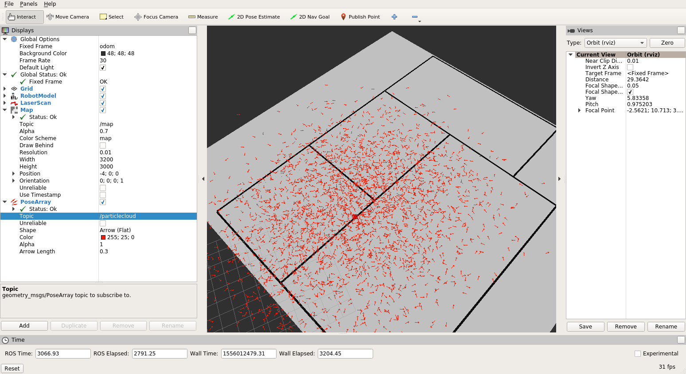
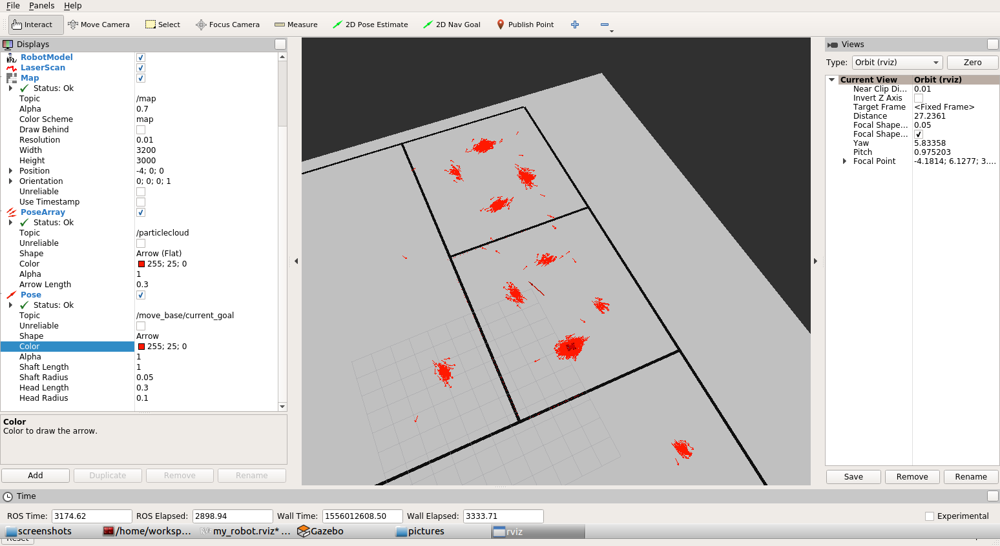
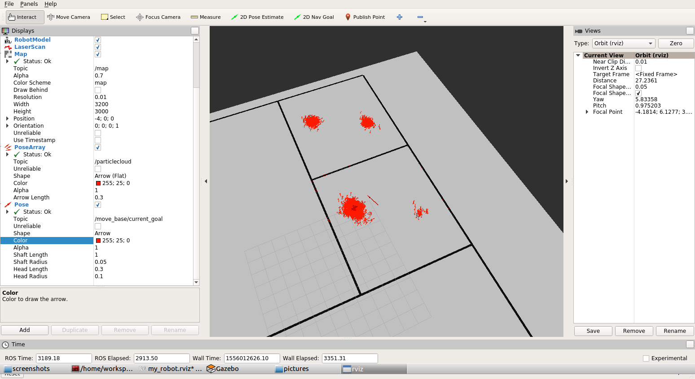

# Project 3 Where Am I 

In this project, the adaptive monte carlo localizatin (AMCL) algorithm is implemented in ROS.


The following steps are required to use the [amcl](http://wiki.ros.org/amcl) ROS package to get a working localization.

## Map Setup

Using the [pgm_create_map](https://github.com/udacity/pgm_map_creator) package a pgm map file needs to be created from the my_world.world file.

Open a terminal, run gzerver with the map file:

```
gzserver src/pgm_map_creator/world/<YOUR GAZEBO WORLD FILE>
```

Open another terminal, launch the request_publisher node

```
roslaunch pgm_map_creator request_publisher.launch
```

Wait for the plugin to generate map. It will be located in the map folder of the pgm_map_creator

Notice that there are no doors in the final map.pgm image. Because of this, the robot won't be able to drive through doors.

The parameters in the launch file of the node were set to 

```
<?xml version="1.0" ?>
<launch>
  <arg name="map_name" default="map" />
  <arg name="save_folder" default="$(find pgm_map_creator)/maps" />
  <arg name="xmin" default="-20" />
  <arg name="xmax" default="12" />
  <arg name="ymin" default="-12" />
  <arg name="ymax" default="12" />
  <arg name="scan_height" default="5" />
  <arg name="resolution" default="0.01" />

  <node pkg="pgm_map_creator" type="request_publisher" name="request_publisher" output="screen" args="'($(arg xmin),$(arg ymax))($(arg xmax),$(arg ymax))($(arg xmax),$(arg ymin))($(arg xmin),$(arg ymin))' $(arg scan_height) $(arg resolution) $(arg save_folder)/$(arg map_name)">
  </node>
</launch>
```

It is hard to find the correct parameters because it is not documented where the origin is defined. The values above were taken from the gazebo simulator. 

## AMCL Launch File

The amcl launch file needs to be created to launch the following three nodes

### Map Server

The server that uses the created pgm map file and provides a map to the amcl node. 

### AMCL Node 

This node is used to localize the robot in the provided map. This node 'links' the robot (odom frame) with the world (map frame). To do this, the node requires the following parameters

- `odom_frame_id` (string, default: "odom"): Which frame to use for odometry
- `odom_model_type` (string, default: "diff"): Which model to use, either "diff", "omni", "diff-corrected" or "omni-corrected"
- `base_frame_id` (string, default: "base_link"): Which frame to use for the robot base
- `global_frame_id` (string, default: "map"): The name of the coordinate frame published by the localization system 


### Move Base Node

To move the robot around either the `teleop` node or the [move base]() node can be used. In a new terminal the `teleop` node can be executed with 

```
rosrun teleop_twist_keyboard teleop_twist_keyboard.py
```

Then it is possible to control the robot with the keyboard.

With the `move base` it is possible to define a navigation goal position for the robot in the map shown in rviz, and the robot will navigate to that goal position.

This node requires planners to move the robot around which is done in the `amcl.launch` file by setting the `base_local_planner` and `base_global_planner` parameters.
Additional parameters for these planners are provided from udacity and set using the rosparam tag.

```
wget https://s3-us-west-1.amazonaws.com/udacity-robotics/Resource/where_am_i/config.zip
```

## Localization Parameters

The amcl node provides a lot of [parameters](http://wiki.ros.org/amcl#Parameters) to tune its behavior. 
In this project I kept the default parameters which lead to satisfying localization results. 
 
## Project Launch

To launch the project first launch the `my_world.world` file from the my_robot package.

```
roslaunch my_robot world.launch
```

In a new terminal the `amcl.launch` file should be launched.

```
roslaunch my_robot amcl.launch
```

Additionally the `telop` node can be launched. 

## Localization Results

Start of the localization after placing the robot inside the building using gazebo simulator. At first the particles shown in red are spread uniformly across the map.  




Setting a goal position using the 2D Nav Goal of rviz. We see that the robot moves to the specified goal and the particles of the amcl algorithm converge to more centerd regions.  



Moving further around the particles get more centerd. However, the robot is not able to fully localize itself because of the two rooms that look similar. 




To localize the robot it should drive through doors which are not present in the created pgm image. 
In the my_world.world file a collision plugin is added in this project.

```
<plugin filename="libcollision_map_creator.so" name="collision_map_creator"/>
```

If I try to steer the robot through doors it gets flipped around because of this collision check.

## Project Folder Structure

```
.Project3                          # Where Am I Project
    ├── my_robot                       # my_robot package
    │   ├── launch                     # launch folder for launch files
    │   │   ├── robot_description.launch
    │   │   ├── world.launch
    │   │   ├── amcl.launch
    │   ├── meshes                     # meshes folder for sensors
    │   │   ├── hokuyo.dae
    │   ├── urdf                       # urdf folder for xarco files
    │   │   ├── rc_robot.gazebo
    │   │   ├── rc_robot.xacro
    │   ├── world                      # world folder for world files
    │   │   ├── <yourworld>.world
    │   ├── CMakeLists.txt             # compiler instructions
    │   ├── package.xml                # package info
    ├── pgm_map_creator                # pgm_map_creator package
    │   ├── launch                     # launch folder for launch files
    │   │   ├── request_publisher.launch
    │   ├── world                      # world files that should be converted
    │   │   ├── my_world.world
    │   ├── maps                       # pgm image files
    │   │   ├── map.pgm
    ├── ball_chaser                    # ball_chaser package
    │   ├── launch                     # launch folder for launch files
    │   │   ├── ball_chaser.launch
    │   ├── src                        # source folder for C++ scripts
    │   │   ├── drive_bot.cpp
    │   │   ├── process_images.cpp
    │   ├── srv                        # service folder for ROS services
    │   │   ├── DriveToTarget.srv
    │   ├── CMakeLists.txt             # compiler instructions
    │   ├── package.xml                # package info
    └──
```

## Plugins

In the Udacity lesson a differential drive robot with two wheels was created.
In the latest version of this repository the robot model has four wheels which requires another gazebo plugin to drive the robot around. 
To steer the robot I used the [skid steering drive plugin](http://gazebosim.org/tutorials?tut=ros_gzplugins#SkidSteeringDrive).
